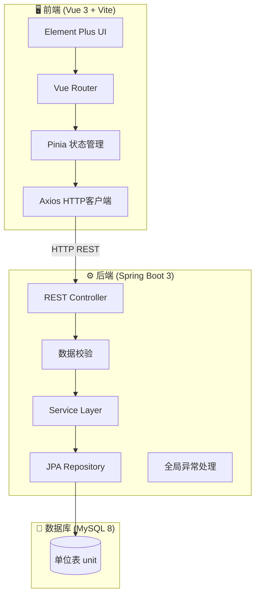
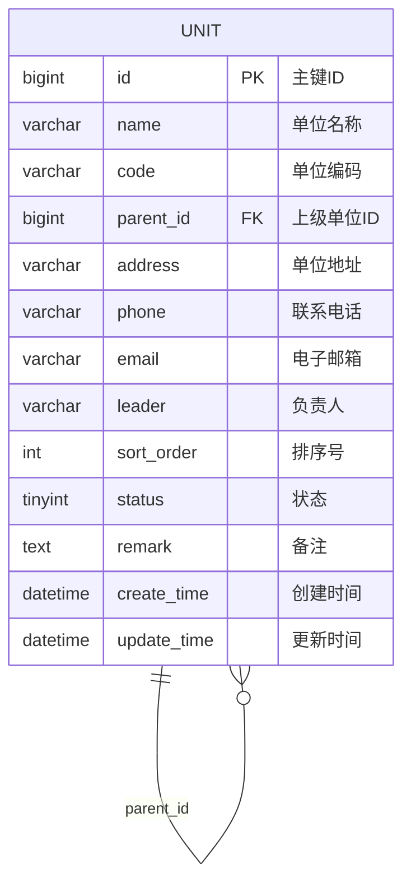

# 单位管理模板系统

> 🏢 **一站式单位管理解决方案** - 现代化的组织架构管理系统

## 📋 项目摘要

单位管理模板系统是一个**商业级全栈应用**，提供完整的组织机构（单位）管理能力。系统采用 Vue 3 + Spring Boot 3 + MySQL 8 现代化技术栈，支持 Docker 一键部署，具备完善的错误处理、日志记录和数据校验机制。

### 核心能力
- ✅ 单位信息的增删改查（CRUD）
- 🔍 单位搜索与筛选（名称、编码、状态）
- 📊 单位列表分页展示
- 🏗️ 上下级单位层级管理（树形结构）
- 📝 完整的表单校验与错误提示

---

## 🏗️ 系统架构



---

## 💾 数据设计



---

## 🛠️ 技术栈

| 层级 | 技术 |
|------|------|
| **Frontend** | Vue 3 + Vite + Vue Router + Pinia + Element Plus |
| **Backend** | Java 17 + Spring Boot 3 + Spring Data JPA + Lombok |
| **Database** | MySQL 8.0 |
| **Infra** | Docker + Docker Compose + Nginx |

---

## 🚀 快速启动 (Docker)

### 前置条件
- Docker Desktop 已安装并运行
- 端口 3000、8000、3306 未被占用

### 启动命令
```bash
# 1. 进入项目目录

# 2. 一键启动所有服务
docker compose up --build

# 首次启动需要下载镜像和编译，请耐心等待约3-5分钟
```

### 访问地址
- 🌐 **前端页面**: http://localhost:3000
- 🔧 **后端API**: http://localhost:8000/api/units

### 停止服务
```bash
docker compose down
```

---

## 📁 项目结构

```
单位管理模板/
├── README.md                    # 项目说明文档
├── docker-compose.yml           # Docker编排文件
├── frontend/                    # 前端项目
│   ├── Dockerfile
│   ├── nginx.conf               # Nginx配置
│   ├── package.json
│   ├── vite.config.js
│   └── src/
│       ├── main.js              # 入口文件
│       ├── App.vue
│       ├── router/              # 路由配置
│       ├── stores/              # Pinia状态管理
│       ├── api/                 # API接口封装
│       ├── styles/              # 全局样式
│       └── views/               # 页面视图
│           ├── Layout.vue       # 布局组件
│           ├── UnitList.vue     # 单位列表
│           └── UnitTree.vue     # 组织架构
└── backend/                     # 后端项目
    ├── Dockerfile
    ├── pom.xml
    └── src/main/
        ├── java/com/example/unit/
        │   ├── UnitApplication.java
        │   ├── controller/      # REST控制器
        │   ├── service/         # 业务逻辑
        │   ├── repository/      # 数据访问
        │   ├── entity/          # 实体类
        │   ├── dto/             # 数据传输对象
        │   ├── exception/       # 异常处理
        │   └── config/          # 配置类
        └── resources/
            ├── application.yml
            ├── application-docker.yml
            └── db/init.sql      # 数据库初始化
```

---

## 📷 功能介绍

### 1. 单位列表页面
- 支持按名称、编码、状态进行搜索筛选
- 分页展示单位数据
- 支持新增、编辑、删除操作
- 表单含完整校验逻辑

### 2. 组织架构页面
- 树形结构展示单位层级关系
- 支持按名称搜索过滤
- 展开/收起全部节点
- 点击查看单位详情

---

## 🔧 专业工程实践

### 1. 日志系统
- 使用 SLF4J + Logback 日志框架
- 分级别记录（DEBUG/INFO/WARN/ERROR）
- 支持文件日志持久化

### 2. 错误处理
- 全局异常处理器 `GlobalExceptionHandler`
- 业务异常 `BusinessException` 封装
- 友好的错误提示信息

### 3. 数据校验
- 使用 JSR-380 (Bean Validation) 注解校验
- 前后端双重校验机制
- 自定义校验规则（手机号、邮箱等）

### 4. 接口设计
- RESTful API 风格
- 统一响应格式 `ApiResponse<T>`
- 支持分页查询与条件过滤

### 5. 生产级特性

| 特性 | 状态 |
|------|------|
| 响应式布局 | ✅ |
| 数据持久化 | ✅ |
| 模块化设计 | ✅ |
| 容器化部署 | ✅ |
| 健康检查 | ✅ |
| CORS支持 | ✅ |

---

## 📊 API接口文档

| 方法 | 路径 | 描述 |
|------|------|------|
| GET | `/api/units` | 分页查询单位列表 |
| GET | `/api/units/all` | 获取所有单位 |
| GET | `/api/units/tree` | 获取单位树形结构 |
| GET | `/api/units/{id}` | 获取单位详情 |
| POST | `/api/units` | 创建单位 |
| PUT | `/api/units/{id}` | 更新单位 |
| DELETE | `/api/units/{id}` | 删除单位 |
| GET | `/api/units/check-code` | 检查编码唯一性 |

---

## 🧪 测试验证

系统启动后可验证以下功能：

1. **访问前端**: http://localhost:3000
2. **查看预置数据**: 系统预置了8条示例单位数据
3. **测试CRUD**: 
   - 新增单位
   - 编辑单位信息
   - 删除单位
   - 搜索筛选
4. **查看组织架构**: 切换到"组织架构"页面查看树形结构

---

## 📝 数据库配置

| 参数 | 值 |
|------|-----|
| 主机 | localhost (Docker外) / db (Docker内) |
| 端口 | 3306 |
| 数据库名 | unit_management |
| 用户名 | root |
| 密码 | 123456 |

---

## ⚠️ 注意事项

1. 首次启动时，Maven会下载依赖包，耗时较长，请耐心等待
2. 如遇到端口冲突，请修改 `docker-compose.yml` 中的端口映射
3. 数据持久化在Docker Volume中，删除容器不会丢失数据
4. 如需完全重置数据：`docker compose down -v`

---

## 🐳 Docker优化配置

本项目已优化Docker构建速度和稳定性，采用以下配置：

### 构建优化特性

1. **前端构建加速**
   - 使用淘宝npm镜像：`https://registry.npmmirror.com`
   - 使用 `npm ci` 替代 `npm install`（快2-3倍）
   - 多阶段构建，最终镜像仅包含nginx+静态文件

2. **后端构建加速**
   - 使用阿里云Maven镜像
   - Maven依赖缓存优化
   - 构建阶段使用 `maven:3.9-eclipse-temurin-17-alpine`
   - 运行阶段使用 `eclipse-temurin:17-jre`（非alpine，更好兼容性）

3. **使用的镜像**
   ```bash
   mysql:8.0                           # 数据库
   maven:3.9-eclipse-temurin-17-alpine # 后端构建
   eclipse-temurin:17-jre              # 后端运行
   node:20-alpine                      # 前端构建
   nginx:alpine                        # 前端运行
   ```

### 如果遇到镜像拉取问题

#### 方案一：手动拉取基础镜像
```bash
docker pull mysql:8.0
docker pull maven:3.9-eclipse-temurin-17-alpine
docker pull eclipse-temurin:17-jre
docker pull node:20-alpine
docker pull nginx:alpine
```

#### 方案二：登录Docker Hub
```bash
docker login
```

### 前端说明
- 前端使用 `npm ci` 进行安装，要求 `package-lock.json` 必须存在
- 如需更新依赖，请先在本地运行 `npm install`，生成新的 `package-lock.json` 后再提交


---

## 📄 License

MIT License
